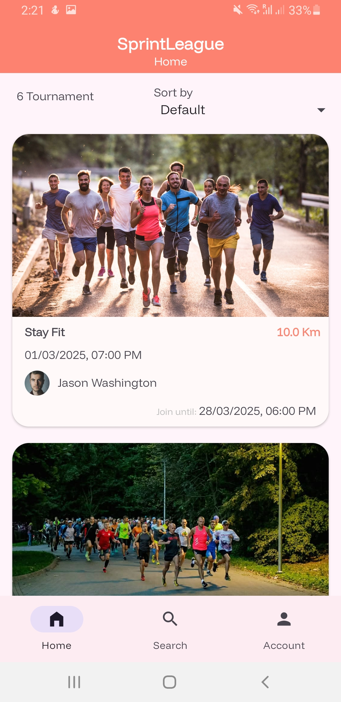
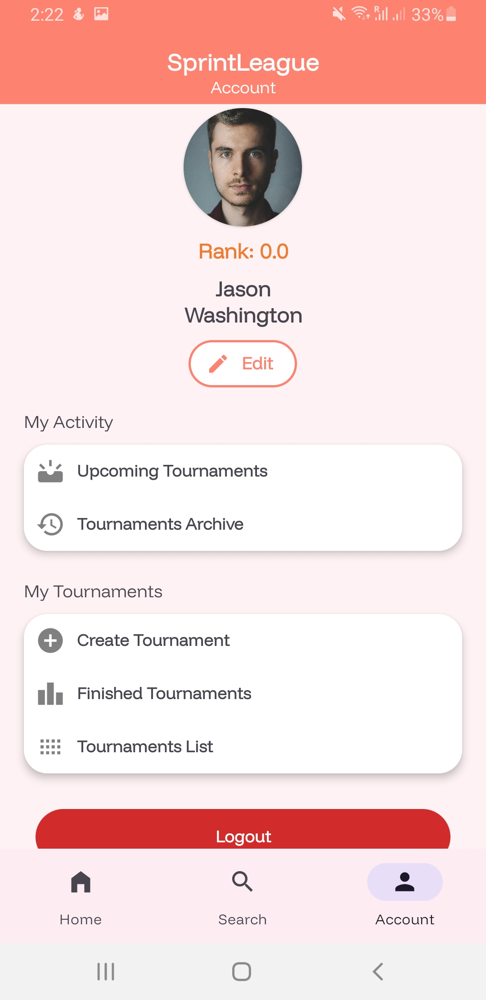
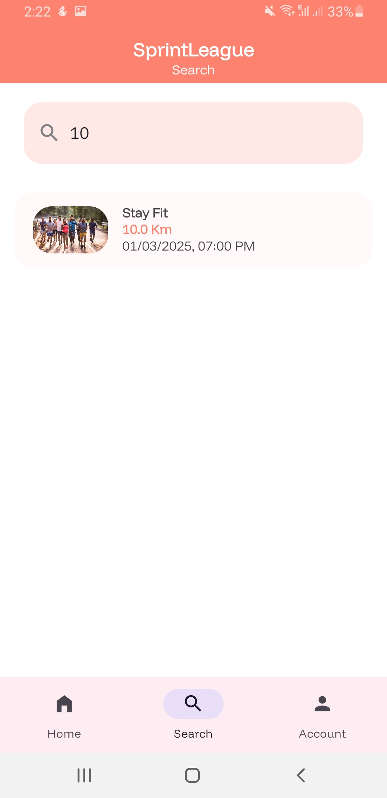
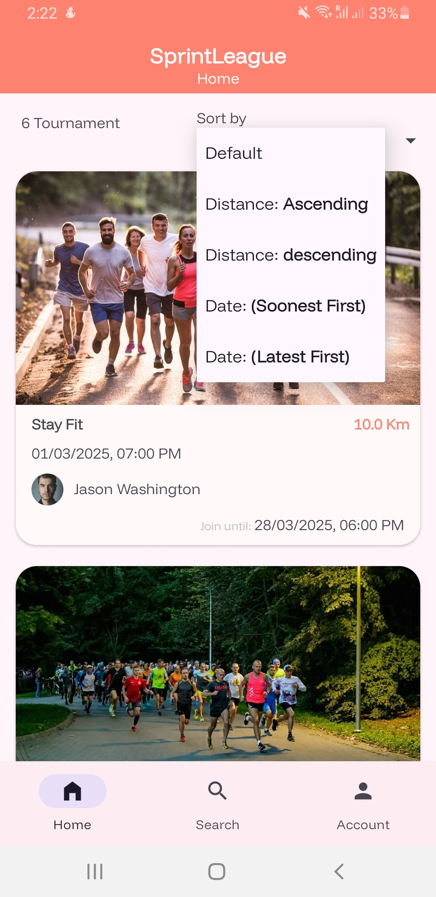
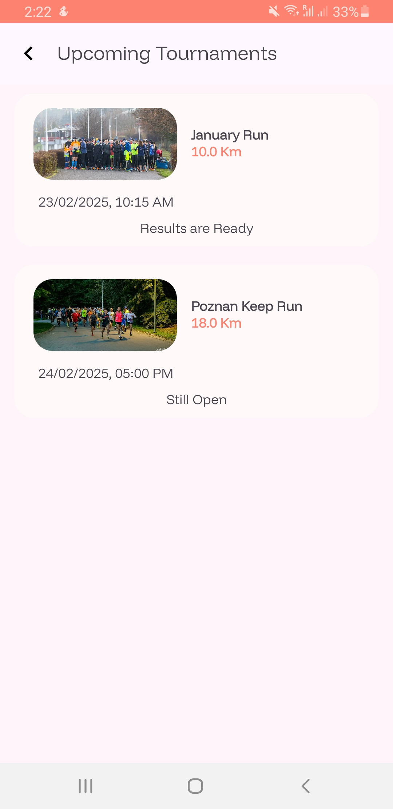
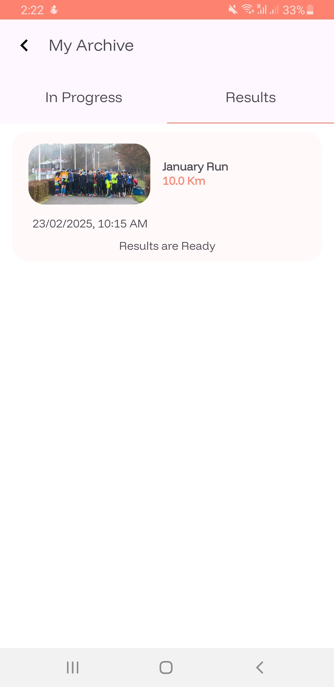
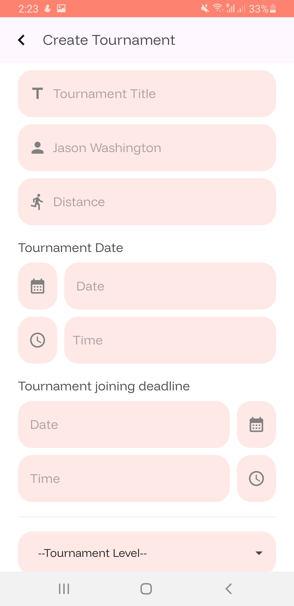
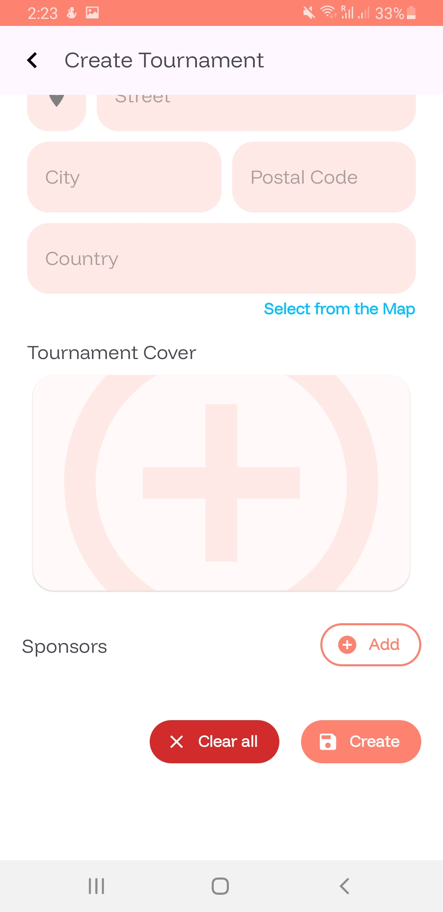
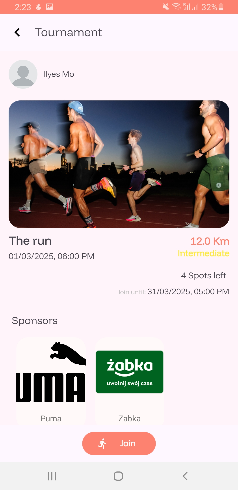

# SprintLeague: Online Tournament System

This project is an **Online Tournament System** developed as part of the Internet Applications laboratory. It is designed to allow users to register, create tournaments, apply to participate in tournaments, and enter game results. The project was built using **Android Studio (Java)** with **Firebase** as the backend for user authentication, data storage, and real-time updates.

## Table of Contents
- [Features](#features)
- [Technologies Used](#technologies-used)
- [Installation](#installation)
- [Usage](#usage)
- [Screenshots](#screenshots)
- [Project Requirements](#project-requirements)


---

## Features
The project provides the following functionality:

1. **User Registration and Authentication**  
   - Registration with first name, last name, email, and password.
   - Email confirmation with a link that expires after 24 hours.
   - Password reset option.

2. **Tournaments Overview**  
   - Main page lists upcoming tournaments with pagination (10 per page).
   - Simple search mechanism for filtering tournaments.

3. **Tournament Details Page**  
   - Displays information such as tournament name, discipline, organizer, date and time, Google Maps location, participant limit, sponsor logos, and participant list.
   - Users can apply to participate, and organizers can edit tournament details.

4. **Tournament Participation**  
   - Users provide a unique license number and ranking when applying.
   - Participation is limited to the specified number of users.

5. **Tournament Ladder & Results**  
   - Automatically generates a tournament ladder after the registration deadline.
   - Players can enter match results. Conflicting results require both users to resubmit.
   - Visual representation of the tournament ladder (not a simple table).

6. **Upcoming Games & Registered Tournaments**  
   - Users can view their upcoming games and tournaments.

7. **Tournament Organization**  
   - Users can create tournaments with all required details.
   - Hosting tournaments in the past is not allowed.

8. **Concurrency Handling**  
   - Ensures accurate participant limits and result submissions with proper data validation.

---

## Technologies Used
- **Android Studio (Java)**: For the development of the mobile application.
- **Firebase**:
  - **Firebase Authentication**: For user registration and login.
  - **Cloud Firestore**: For storing tournament and user data.
  - **Firebase Realtime Database**: For real-time updates of tournament ladders.
  - **Firebase Cloud Functions**: For handling backend logic like email confirmations and result conflict resolution.

---

## Installation
To run this project locally, follow these steps:

1. **Clone the Repository**  
   ```bash
   git clone https://github.com/chihab4real/SprintLeague.git
   ```

2. **Open in Android Studio**
  - Open the project in Android Studio.

3. **Firebase Setup**
  - Create a Firebase project in the Firebase Console.
  - Add your Android app to the Firebase project and download the google-services.json file.
  - Place the google-services.json file in the app directory of the project.

4. **Dependencies**
  - Ensure the following dependencies are added to build.gradle:

 ```bash
 implementation 'com.google.firebase:firebase-auth:21.1.0'
 implementation 'com.google.firebase:firebase-firestore:24.7.1'
 implementation 'com.google.firebase:firebase-database:20.3.0'
 ```

5. **Run the App**
  - Sync the project and run it on an emulator or connected device.

## Usage
1. **Registration**
  - Users must register and confirm their email to activate their account.

2. **Login**
  - Log in with registered email and password.

3. **Tournament Management**

  - Create tournaments or view upcoming tournaments.
  - Apply to participate in tournaments.

4. **Result Submission**
  - Enter match results and view updated tournament ladders.

## Screenshots

| **Feature**                 | **Description**                                                                    | **Screenshot**                               |
|-----------------------------|------------------------------------------------------------------------------------|----------------------------------------------|
| Main Page                   | Displays the list of upcoming tournaments with pagination and a search bar.        |       |
| User Profile                | Shows user information, registered tournaments, and tournaments they are organizing. |  |
| Search                      | Allows users to search for tournaments by name or discipline.                      |             |
| Sorting                     | Users can sort tournaments by date, name, or other criteria.                       |           |
| Upcoming Tournaments        | Displays tournaments the user is registered for.                                   |  |
| Archive of Tournaments      | Shows past tournaments that users can view for results and standings.              |  |
| Create Tournament (Step 1)  | Step 1 of the tournament creation process, where users input general tournament information. |  |
| Create Tournament (Step 2)  | Step 2 of the tournament creation process, where users set the participant limit and other details. |  |
| Tournament Page             | Displays detailed information about a tournament, including participants, schedule, and results. |  |

## Project Requirements

The project fulfills the following functional and non-functional requirements:

### Functional Requirements
  - User registration, email confirmation, and login.
  - Display of upcoming tournaments with search and pagination.
  - Tournament details page with information and participation options.
  - Tournament ladder generation and result submission.
  - Visual representation of the tournament ladder.
  - User-managed tournaments and participant limits.

### Non-functional Requirements
  - Data Validation: Ensures all required fields are properly validated.
  - Concurrency Handling: Prevents over-registration and conflicting result submissions.

